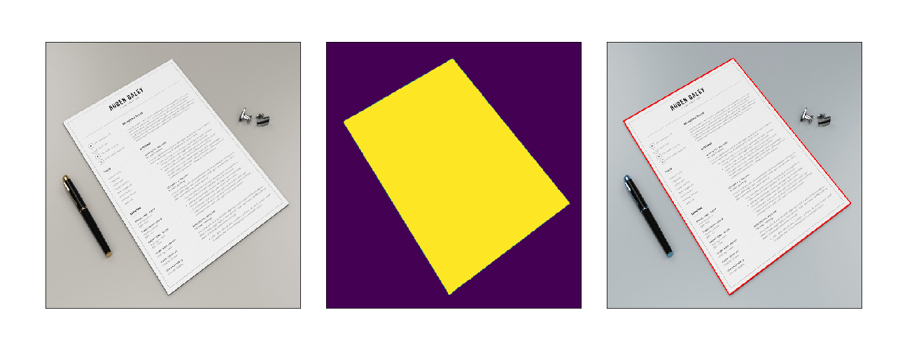
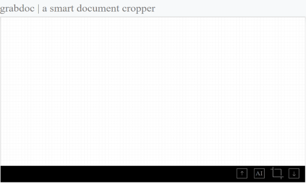
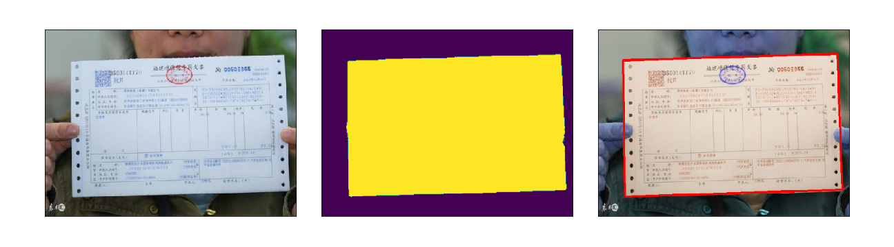
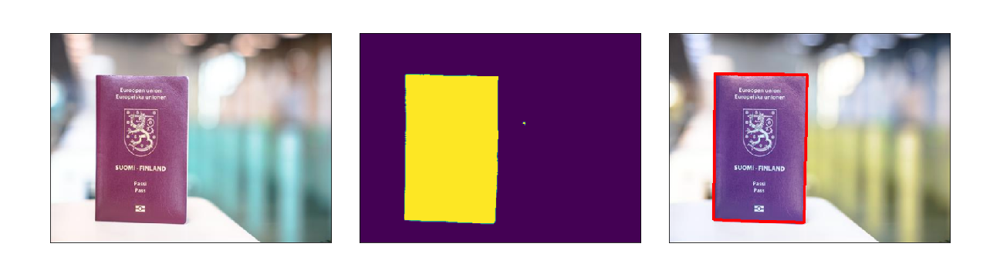
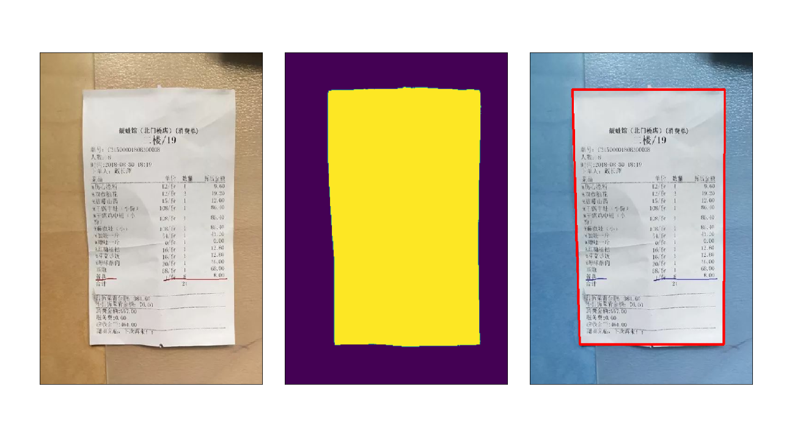
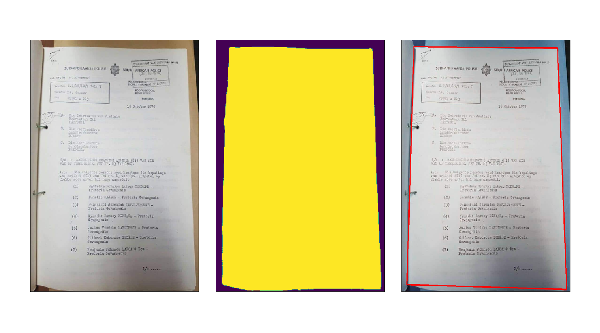
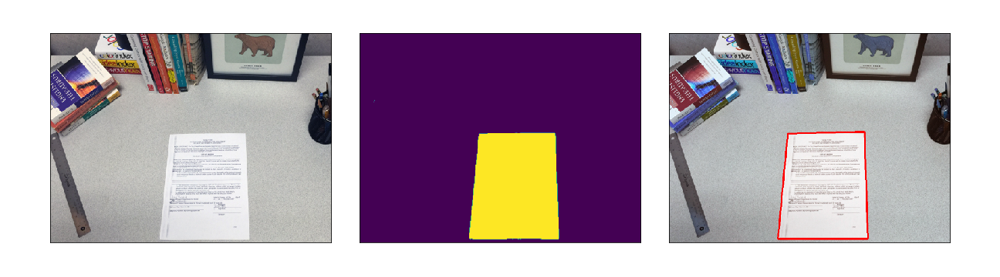

# grabdoc  

grabdoc is a deep learning based application to extract document from image. The application outputs a
RGBA image in which the alpha mask is generated by a Semantic Segmenatation model. The model is based on [MobileNets: Efficient Convolutional
Neural Networks for Mobile Vision Applications](https://arxiv.org/abs/1704.04861). 



The reposity includes a pretrained model and a flask based Web UI. 

---
## How to use
### Requirements  
Python 3.6 and it depends on the following packages listed:

* Tensorflow==1.13.1  
* opencv-python  
* numpy  
* flask  
* pillow  

You can install all those packages via pip. 
```
pip install -r requirements 
```
If you use docker, you can install the environment from Dockerfile.

### CLI 
Please note the output image should be specified with a PNG extension
```
python grabdoc.py samples/ellie.jpg -o output.png
```
### GUI  
If you use docker, a Flask web server will be started by default after your container is running. Otherwise, you have to start the web server manually. 
```
python flask/app.py
```
The port of Flask server is hardcoded to 8080. You can visit the home page via http://{remotehost}:8080/ after it started.

A simele GUI was developed to crop the document intelligently. (I did't upload as the desgin/code is too ugly).
<p align="center">
  
</p>

## More samples  
[demo.ipynb](./demo.ipynb) is used to generate the results of sample images.  









